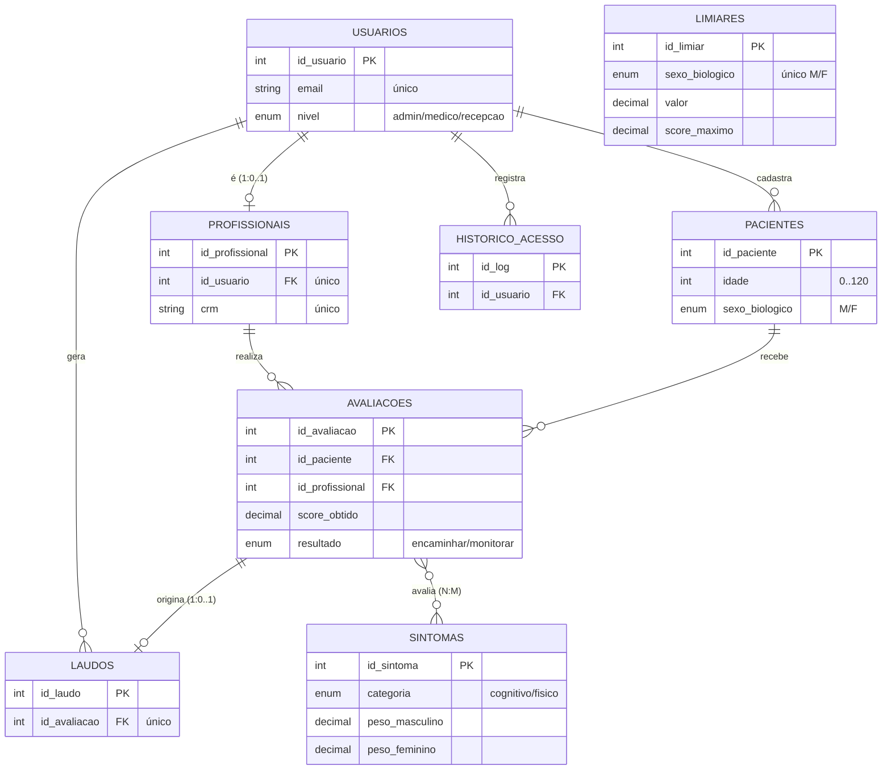

# Documentação do Banco de Dados — SXF Triagem

> **Protocolo SXF·BR — Versão 2.0.0**
> Sistema de triagem clínica para Síndrome do X Frágil (SXF).
> Pesos e limiares alinhados a **Romero et al. (2025)**, Tabelas 4 e 5.
> SGBD: **MySQL 8.0+ / MariaDB 10.4+** · Engine **InnoDB** · Charset **utf8mb4**.

Este documento reúne os três modelos de dados (conceitual, lógico e físico), a justificativa de
integridade referencial e o dicionário de dados completo. Serve tanto como documentação técnica do
repositório quanto como roteiro para a prova de autoria.

## Sumário

1. [Visão geral](#1-visão-geral)
2. [Modelo conceitual (ER)](#2-modelo-conceitual-er)
3. [Modelo lógico (relacional + 3FN)](#3-modelo-lógico-relacional--3fn)
4. [Modelo físico (DDL/SQL)](#4-modelo-físico-ddlsql)
5. [Integridade referencial](#5-integridade-referencial)
6. [Dicionário de dados](#6-dicionário-de-dados)
7. [Regras de domínio: pesos, limiares e score](#7-regras-de-domínio-pesos-limiares-e-score)
8. [Como executar o banco do zero](#8-como-executar-o-banco-do-zero)
9. [Roteiro para a prova de autoria](#9-roteiro-para-a-prova-de-autoria)

---

## 1. Visão geral

O banco modela o fluxo de uma triagem para SXF: um **profissional** (vinculado a um **usuário** do
sistema) realiza uma **avaliação** de um **paciente**, marcando quais dos 12 **sintomas** do protocolo
estão presentes. Cada marcação vira uma **resposta**; a soma dos pesos das respostas presentes gera um
**score**, comparado a um **limiar** por sexo para decidir entre *encaminhar* ou *monitorar*. Da
avaliação pode ser emitido um **laudo**. Toda ação relevante é registrada no **histórico de acesso**.

| # | Tabela | Papel |
|---|--------|-------|
| 1 | `usuarios` | Contas de acesso e perfil (admin/médico/recepção) |
| 2 | `profissionais` | Dados profissionais (CRM) de um usuário |
| 3 | `pacientes` | Pessoas triadas |
| 4 | `sintomas` | Catálogo dos 12 sinais do protocolo, com peso por sexo |
| 5 | `limiares` | Limiar de corte e score máximo por sexo |
| 6 | `avaliacoes` | Cada triagem realizada (score, limiar aplicado, resultado) |
| 7 | `respostas_avaliacao` | Resposta por sintoma dentro de uma avaliação (entidade associativa) |
| 8 | `laudos` | Laudo emitido a partir de uma avaliação |
| 9 | `historico_acesso` | Trilha de auditoria das ações dos usuários |

São **9 tabelas**, **8 chaves estrangeiras**, todas em InnoDB com `utf8mb4_unicode_ci`.

---

## 2. Modelo conceitual (ER)

O modelo conceitual descreve **entidades** e **relacionamentos** independentemente de SGBD. No nível
conceitual, uma avaliação registra a presença de **vários** sintomas e um sintoma aparece em **várias**
avaliações — ou seja, há um relacionamento **N:M** entre `avaliacoes` e `sintomas`, que no modelo lógico
será resolvido pela entidade associativa `respostas_avaliacao`.



> `LIMIARES` é uma **tabela de configuração/referência**: não possui chave estrangeira porque é
> consultada pela lógica de negócio (cálculo do score), sem relacionamento estrutural com as demais
> entidades. Por isso aparece isolada no diagrama.

### Justificativa das entidades

- **`usuarios` × `profissionais`** — separamos a *conta de acesso* (genérica, com perfil e senha) do
  *papel clínico* (médico com CRM). Nem todo usuário é profissional (recepção e admin não têm CRM),
  por isso a relação é **1 para 0..1** e não uma única tabela. Isso evita colunas nulas (CRM,
  especialidade) na maioria dos usuários.
- **`pacientes`** — pessoa triada. `responsavel` é opcional porque só se aplica a menores.
- **`sintomas`** — catálogo fixo dos 12 sinais do protocolo; manter como tabela (e não como colunas)
  permite ligar/desligar sinais (`ativo`) e ajustar pesos sem alterar o esquema.
- **`avaliacoes`** — o evento central. Guarda o resultado consolidado (score, limiar aplicado,
  decisão) de cada triagem.
- **`respostas_avaliacao`** — entidade associativa que resolve o N:M entre avaliação e sintoma,
  guardando o atributo do relacionamento (`presente`, `peso_aplicado`).
- **`laudos`** — documento clínico derivado de uma avaliação (1:0..1: nem toda avaliação gera laudo,
  mas um laudo pertence a exatamente uma avaliação).
- **`limiares`** — parâmetros de corte por sexo, configuráveis.
- **`historico_acesso`** — auditoria; requisito de rastreabilidade em dados de saúde.

### Cardinalidades

| Relacionamento | Cardinalidade | Leitura |
|----------------|---------------|---------|
| usuarios → profissionais | 1 : 0..1 | um usuário é, no máximo, um profissional |
| usuarios → pacientes | 1 : N | um usuário cadastra vários pacientes |
| usuarios → laudos | 1 : N | um usuário gera vários laudos |
| usuarios → historico_acesso | 1 : N | um usuário gera vários registros de log |
| profissionais → avaliacoes | 1 : N | um profissional realiza várias avaliações |
| pacientes → avaliacoes | 1 : N | um paciente recebe várias avaliações |
| avaliacoes → respostas_avaliacao | 1 : N | uma avaliação tem várias respostas |
| sintomas → respostas_avaliacao | 1 : N | um sintoma é referenciado em várias respostas |
| avaliacoes → laudos | 1 : 0..1 | uma avaliação origina no máximo um laudo |

---

## 3. Modelo lógico (relacional + 3FN)

Derivação do modelo conceitual para o relacional. Notação: **PK** sublinhada como `_chave_`, chaves
estrangeiras marcadas com *(FK)*.

```
usuarios(_id_usuario_, nome, email[UNIQUE], senha_hash, nivel, ativo, criado_em, ultimo_acesso)

profissionais(_id_profissional_, id_usuario[UNIQUE](FK→usuarios), nome_completo,
              crm[UNIQUE], especialidade, criado_em)

pacientes(_id_paciente_, nome_completo, idade, sexo_biologico, responsavel,
          criado_em, criado_por(FK→usuarios))

sintomas(_id_sintoma_, nome, categoria, peso_masculino, peso_feminino, ativo)

limiares(_id_limiar_, sexo_biologico[UNIQUE], valor, score_maximo, atualizado_em)

avaliacoes(_id_avaliacao_, id_paciente(FK→pacientes), id_profissional(FK→profissionais),
           score_obtido, limiar_aplicado, resultado, observacoes, data_avaliacao)

respostas_avaliacao(_id_resposta_, id_avaliacao(FK→avaliacoes), id_sintoma(FK→sintomas),
                    presente, peso_aplicado)
                    -- UNIQUE(id_avaliacao, id_sintoma)

laudos(_id_laudo_, id_avaliacao[UNIQUE](FK→avaliacoes), indicacao, resumo_diagnostico,
       gerado_em, gerado_por(FK→usuarios))

historico_acesso(_id_log_, id_usuario(FK→usuarios), acao, entidade, entidade_id, ip, momento)
```

A entidade associativa `respostas_avaliacao` resolve o N:M conceitual: a restrição
`UNIQUE(id_avaliacao, id_sintoma)` garante **uma resposta por sintoma por avaliação** (a chave natural
do relacionamento), enquanto `id_resposta` é uma chave substituta (*surrogate*) para simplificar as FKs.

### Justificativa da normalização (até 3FN)

**1ª Forma Normal (1FN)** — todas as colunas são atômicas; não há grupos repetitivos nem listas em uma
mesma célula. Os sintomas, por exemplo, não foram modelados como 12 colunas em `avaliacoes`, e sim como
linhas em `respostas_avaliacao`.

**2ª Forma Normal (2FN)** — está em 1FN e todo atributo não-chave depende da **chave inteira**. Como
todas as tabelas usam chave primária simples (surrogate `INT AUTO_INCREMENT`), não existe dependência
parcial possível. Em `respostas_avaliacao`, mesmo havendo a chave candidata composta
(`id_avaliacao`, `id_sintoma`), os atributos `presente` e `peso_aplicado` dependem da combinação
completa, não de parte dela.

**3ª Forma Normal (3FN)** — está em 2FN e não há dependências transitivas (atributo não-chave
dependendo de outro atributo não-chave). Cada atributo descritivo depende **apenas** da chave da sua
tabela. Dados de profissional (CRM, especialidade) ficam em `profissionais`, não em `avaliacoes`;
descrição e categoria do sintoma ficam em `sintomas`, não em `respostas_avaliacao`.

### Desnormalização deliberada (snapshots de auditoria)

Três colunas armazenam valores que **poderiam** ser recalculados — e isso é uma decisão de projeto
consciente, **não** uma violação de 3FN por descuido:

- `avaliacoes.limiar_aplicado` — cópia do limiar vigente no momento da triagem;
- `avaliacoes.score_obtido` — score consolidado daquela avaliação;
- `respostas_avaliacao.peso_aplicado` — peso do sintoma no momento da resposta.

O motivo é **integridade histórica/temporal**: os pesos (`sintomas`) e o limiar (`limiares`) podem ser
atualizados depois (a coluna `limiares.atualizado_em` existe justamente para isso). Se o resultado
dependesse de um JOIN com os valores *atuais*, uma avaliação antiga passaria a exibir um score
diferente do que foi de fato registrado e assinado pelo profissional. Guardar o *snapshot* preserva a
prova do que foi calculado naquela data. É o mesmo princípio de uma nota fiscal que guarda o preço
praticado na venda, e não o preço atual do produto.

---

## 4. Modelo físico (DDL/SQL)

O script físico está em [`schema.sql`](../schema.sql) e é **executável do zero** (validado — ver
seção 8). Decisões de implementação:

- **Engine InnoDB** — necessária para chaves estrangeiras transacionais e ACID.
- **`utf8mb4` / `utf8mb4_unicode_ci`** — suporte completo a Unicode (acentuação e emojis) e
  comparação acento-insensível, adequado a nomes em português.
- **Chaves substitutas `INT AUTO_INCREMENT`** — PKs estáveis e independentes de dados de negócio.
- **`DECIMAL(3,2)` para pesos e limiares** — precisão exata (evita o erro de arredondamento do
  `FLOAT`), suficiente para valores de 0,00 a 9,99; `DECIMAL(4,2)` em `score_maximo`/`score_obtido`
  comporta a soma dos pesos.
- **`ENUM`** para domínios fechados e pequenos — `nivel`, `sexo_biologico`, `categoria`,
  `resultado` — restringe os valores no próprio SGBD.
- **`TINYINT(1)`** para flags booleanas (`ativo`, `presente`).
- **`CHECK (idade >= 0 AND idade <= 120)`** — validação de domínio no banco (MySQL 8.0.16+ /
  MariaDB 10.2+).
- **Restrições `UNIQUE`** — `email`, `crm`, `id_usuario` em profissionais (garante o 1:1),
  `id_avaliacao` em laudos (garante o 1:1) e `(id_avaliacao, id_sintoma)` em respostas.
- **Índices** — criados nas colunas mais filtradas (`email`, `nivel`, `categoria`, `resultado`,
  `nome_completo`, `momento`) e automaticamente nas FKs.
- **`TIMESTAMP DEFAULT CURRENT_TIMESTAMP`** — carimbo automático de criação; `limiares.atualizado_em`
  usa `ON UPDATE CURRENT_TIMESTAMP`.
- **`senha_hash VARCHAR(255)`** — armazena hash (werkzeug), nunca a senha em texto puro.

---

## 5. Integridade referencial

Todas as 8 FKs declaram explicitamente `ON DELETE` e `ON UPDATE`. A estratégia distingue **dados
clínicos** (que não podem desaparecer) de **dados subordinados** (que só existem dentro de um pai).

| Tabela (filha) | Referencia | ON DELETE | ON UPDATE | Justificativa |
|----------------|-----------|-----------|-----------|---------------|
| `profissionais` | `usuarios` | RESTRICT | CASCADE | não apagar usuário com vínculo profissional |
| `pacientes` | `usuarios` | RESTRICT | CASCADE | preserva autoria do cadastro |
| `avaliacoes` | `pacientes` | RESTRICT | CASCADE | registro clínico não pode ser apagado em cascata |
| `avaliacoes` | `profissionais` | RESTRICT | CASCADE | mantém responsabilidade técnica |
| `respostas_avaliacao` | `avaliacoes` | **CASCADE** | CASCADE | resposta só existe dentro da avaliação |
| `respostas_avaliacao` | `sintomas` | RESTRICT | CASCADE | não apagar sintoma usado em respostas |
| `laudos` | `avaliacoes` | RESTRICT | CASCADE | laudo é documento clínico permanente |
| `laudos` | `usuarios` | RESTRICT | CASCADE | preserva quem emitiu o laudo |
| `historico_acesso` | `usuarios` | RESTRICT | CASCADE | log de auditoria não some com o usuário |

**Por que `RESTRICT` na maioria?** Em sistema de saúde, apagar em cascata um paciente, profissional ou
usuário destruiria silenciosamente avaliações e laudos — perda inaceitável de registro clínico. O
`RESTRICT` força tratar o vínculo antes (ou usar a flag `ativo` para inativação lógica).

**Por que `CASCADE` em `respostas_avaliacao → avaliacoes`?** Uma resposta é parte indissociável da sua
avaliação (existência dependente). Apagar a avaliação deve apagar suas respostas — comprovado em teste:
ao remover uma avaliação com respostas, a contagem de respostas foi de 1 para 0 automaticamente.

**`ON UPDATE CASCADE`** em todas — se uma PK fosse alterada, as FKs acompanham. Na prática raro (PKs
são `AUTO_INCREMENT`), mas é a opção segura.

---

## 6. Dicionário de dados

Tipos e restrições extraídos do banco já criado (`information_schema`).

### 6.1 `usuarios` — contas de acesso

| Coluna | Tipo | Nulo | Chave | Padrão | Descrição |
|--------|------|------|-------|--------|-----------|
| id_usuario | INT | Não | PK | auto_inc | Identificador da conta |
| nome | VARCHAR(120) | Não | | | Nome de exibição |
| email | VARCHAR(150) | Não | UNIQUE | | E-mail de login (único) |
| senha_hash | VARCHAR(255) | Não | | | Hash da senha (werkzeug) |
| nivel | ENUM('admin','medico','recepcao') | Não | IDX | 'recepcao' | Perfil de acesso |
| ativo | TINYINT(1) | Não | | 1 | Conta ativa (1) ou inativada (0) |
| criado_em | TIMESTAMP | Não | | CURRENT_TIMESTAMP | Data de criação |
| ultimo_acesso | TIMESTAMP | Sim | | NULL | Último login |

### 6.2 `profissionais` — dados clínicos do usuário

| Coluna | Tipo | Nulo | Chave | Padrão | Descrição |
|--------|------|------|-------|--------|-----------|
| id_profissional | INT | Não | PK | auto_inc | Identificador do profissional |
| id_usuario | INT | Não | UNIQUE (FK) | | Usuário vinculado (1:1) |
| nome_completo | VARCHAR(150) | Não | | | Nome civil completo |
| crm | VARCHAR(30) | Não | UNIQUE | | Registro no conselho (único) |
| especialidade | VARCHAR(100) | Sim | | NULL | Especialidade médica |
| criado_em | TIMESTAMP | Não | | CURRENT_TIMESTAMP | Data de criação |

### 6.3 `pacientes` — pessoas triadas

| Coluna | Tipo | Nulo | Chave | Padrão | Descrição |
|--------|------|------|-------|--------|-----------|
| id_paciente | INT | Não | PK | auto_inc | Identificador do paciente |
| nome_completo | VARCHAR(150) | Não | IDX | | Nome completo |
| idade | TINYINT | Não | | | Idade em anos (CHECK 0–120) |
| sexo_biologico | ENUM('M','F') | Não | | | Sexo biológico (define pesos/limiar) |
| responsavel | VARCHAR(150) | Sim | | NULL | Responsável legal (menores) |
| criado_em | TIMESTAMP | Não | | CURRENT_TIMESTAMP | Data de cadastro |
| criado_por | INT | Não | (FK) | | Usuário que cadastrou |

### 6.4 `sintomas` — catálogo dos 12 sinais

| Coluna | Tipo | Nulo | Chave | Padrão | Descrição |
|--------|------|------|-------|--------|-----------|
| id_sintoma | INT | Não | PK | auto_inc | Identificador do sintoma |
| nome | VARCHAR(160) | Não | | | Descrição do sinal clínico |
| categoria | ENUM('cognitivo','fisico') | Não | IDX | | Grupo (cognitivo agrupa cognitivo+comportamental) |
| peso_masculino | DECIMAL(3,2) | Não | | 0.00 | Peso do sinal para sexo M |
| peso_feminino | DECIMAL(3,2) | Não | | 0.00 | Peso do sinal para sexo F |
| ativo | TINYINT(1) | Não | | 1 | Sintoma em uso (1) ou desativado (0) |

### 6.5 `limiares` — corte por sexo

| Coluna | Tipo | Nulo | Chave | Padrão | Descrição |
|--------|------|------|-------|--------|-----------|
| id_limiar | INT | Não | PK | auto_inc | Identificador do limiar |
| sexo_biologico | ENUM('M','F') | Não | UNIQUE | | Sexo ao qual o limiar se aplica |
| valor | DECIMAL(3,2) | Não | | | Limiar de corte (sensibilidade 95%) |
| score_maximo | DECIMAL(4,2) | Não | | | Score máximo possível para o sexo |
| atualizado_em | TIMESTAMP | Não | | CURRENT_TIMESTAMP (ON UPDATE) | Última atualização |

### 6.6 `avaliacoes` — triagens realizadas

| Coluna | Tipo | Nulo | Chave | Padrão | Descrição |
|--------|------|------|-------|--------|-----------|
| id_avaliacao | INT | Não | PK | auto_inc | Identificador da avaliação |
| id_paciente | INT | Não | (FK) | | Paciente avaliado |
| id_profissional | INT | Não | (FK) | | Profissional responsável |
| score_obtido | DECIMAL(4,2) | Não | | 0.00 | Score calculado (snapshot) |
| limiar_aplicado | DECIMAL(3,2) | Não | | | Limiar vigente na triagem (snapshot) |
| resultado | ENUM('encaminhar','monitorar') | Não | IDX | | Decisão da triagem |
| observacoes | TEXT | Sim | | NULL | Notas livres |
| data_avaliacao | TIMESTAMP | Não | | CURRENT_TIMESTAMP | Data/hora da triagem |

### 6.7 `respostas_avaliacao` — resposta por sintoma

| Coluna | Tipo | Nulo | Chave | Padrão | Descrição |
|--------|------|------|-------|--------|-----------|
| id_resposta | INT | Não | PK | auto_inc | Identificador da resposta |
| id_avaliacao | INT | Não | (FK) | | Avaliação à qual pertence |
| id_sintoma | INT | Não | (FK) | | Sintoma avaliado |
| presente | TINYINT(1) | Não | | 0 | Sintoma presente (1) ou ausente (0) |
| peso_aplicado | DECIMAL(3,2) | Não | | 0.00 | Peso usado no cálculo (snapshot) |

> Restrição `UNIQUE(id_avaliacao, id_sintoma)`: impede duas respostas para o mesmo sintoma na mesma
> avaliação.

### 6.8 `laudos` — documento emitido

| Coluna | Tipo | Nulo | Chave | Padrão | Descrição |
|--------|------|------|-------|--------|-----------|
| id_laudo | INT | Não | PK | auto_inc | Identificador do laudo |
| id_avaliacao | INT | Não | UNIQUE (FK) | | Avaliação de origem (1:1) |
| indicacao | VARCHAR(100) | Não | | | Indicação/encaminhamento |
| resumo_diagnostico | TEXT | Sim | | NULL | Resumo textual |
| gerado_em | TIMESTAMP | Não | | CURRENT_TIMESTAMP | Data de emissão |
| gerado_por | INT | Não | (FK) | | Usuário que emitiu |

### 6.9 `historico_acesso` — auditoria

| Coluna | Tipo | Nulo | Chave | Padrão | Descrição |
|--------|------|------|-------|--------|-----------|
| id_log | INT | Não | PK | auto_inc | Identificador do log |
| id_usuario | INT | Não | (FK) | | Usuário autor da ação |
| acao | VARCHAR(80) | Não | | | Ação executada |
| entidade | VARCHAR(60) | Sim | | NULL | Entidade afetada |
| entidade_id | INT | Sim | | NULL | ID do registro afetado |
| ip | VARCHAR(45) | Sim | | NULL | IP de origem (suporta IPv6) |
| momento | TIMESTAMP | Não | IDX | CURRENT_TIMESTAMP | Data/hora do evento |

---

## 7. Regras de domínio: pesos, limiares e score

Os dados-semente (*seeds*) reproduzem o protocolo de Romero et al. (2025).

**12 sintomas** com peso por sexo (`P = FX − FN`, frequência em afetados menos frequência em não
afetados): deficiência intelectual, dificuldades de aprendizagem, déficit de atenção, atraso de
fala/linguagem, hiperatividade, estereotipias, contato visual/físico, comportamento agressivo
(categoria `cognitivo`); hiperflexibilidade articular, macroorquidismo (apenas M), face
alongada/orelhas salientes (categoria `fisico`).

**2 limiares** (corte de 95% de sensibilidade): `M = 0,56` (score máx. 1,95) e `F = 0,55` (score máx.
1,00).

**Lógica de score** (executada na aplicação, não no banco): para cada sintoma presente soma-se o peso
correspondente ao sexo do paciente; se a soma `≥ limiar` do sexo, o resultado é `encaminhar`, senão
`monitorar`. O banco apenas **persiste** os pesos, o limiar e o resultado consolidado — o cálculo é
responsabilidade da camada de regras de negócio.

---

## 8. Como executar o banco do zero

```bash
# MySQL ou MariaDB
mysql -u root -p < schema.sql
```

Isso cria o database `sxf_triagem`, as 9 tabelas, todas as FKs/índices e insere os seeds
(12 sintomas + 2 limiares). O script é idempotente nas criações (`CREATE DATABASE/TABLE IF NOT
EXISTS`).

> **Validação realizada:** o `schema.sql` foi executado em uma instância limpa (MariaDB 10.11). Saída:
> exit code 0, 9 tabelas criadas, 12 sintomas e 2 limiares inseridos, CHECK de idade rejeitando valor
> fora de 0–120, e CASCADE de `respostas_avaliacao` confirmado.

---


- **Como o score é calculado?**
  Soma dos pesos dos sintomas presentes (por sexo) comparada ao limiar do sexo; o banco persiste o
  resultado, a aplicação faz o cálculo.
